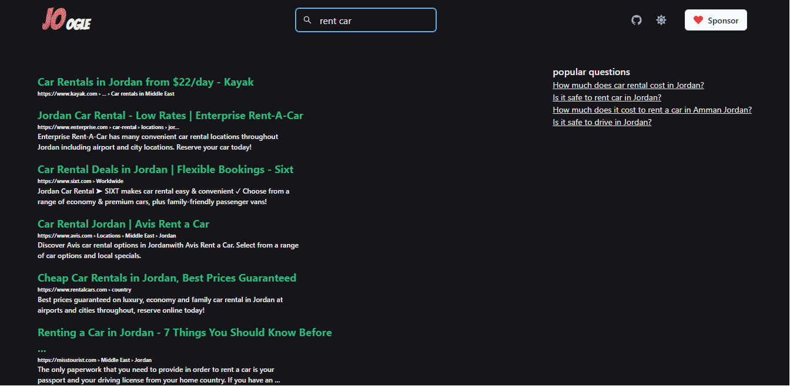
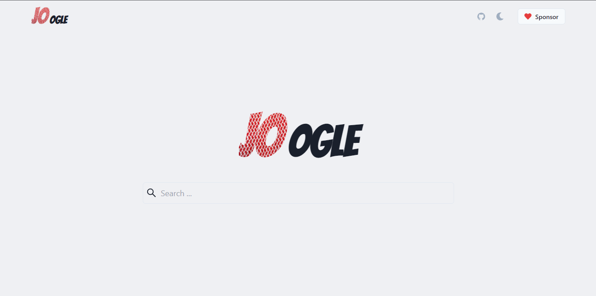

# Joogle - search engine

## Welcome! 👋

Thanks for checking out this project!

this project is using the Google Api from rapid API spicified search about jordan

## Table of contents

- [Overview](#overview)
  - [Links](#links)
  - [Screenshot](#screenshot)

- [My process](#my-process)
  - [Built with](#built-with)
- [Author](#author)

## Overview

### Links

- Chakra UI: [docs](https://chakra-ui.com)
- Choc UI: [docs](https://choc-ui.com)
### Screenshot

## My process

### Built with
- React
- Redux
- Redux-Toolkit
- tailwindcss
- Chakra UI

## Author
- Twitter - [@joseph2s5](https://www.twitter.com/joseph2s5)
